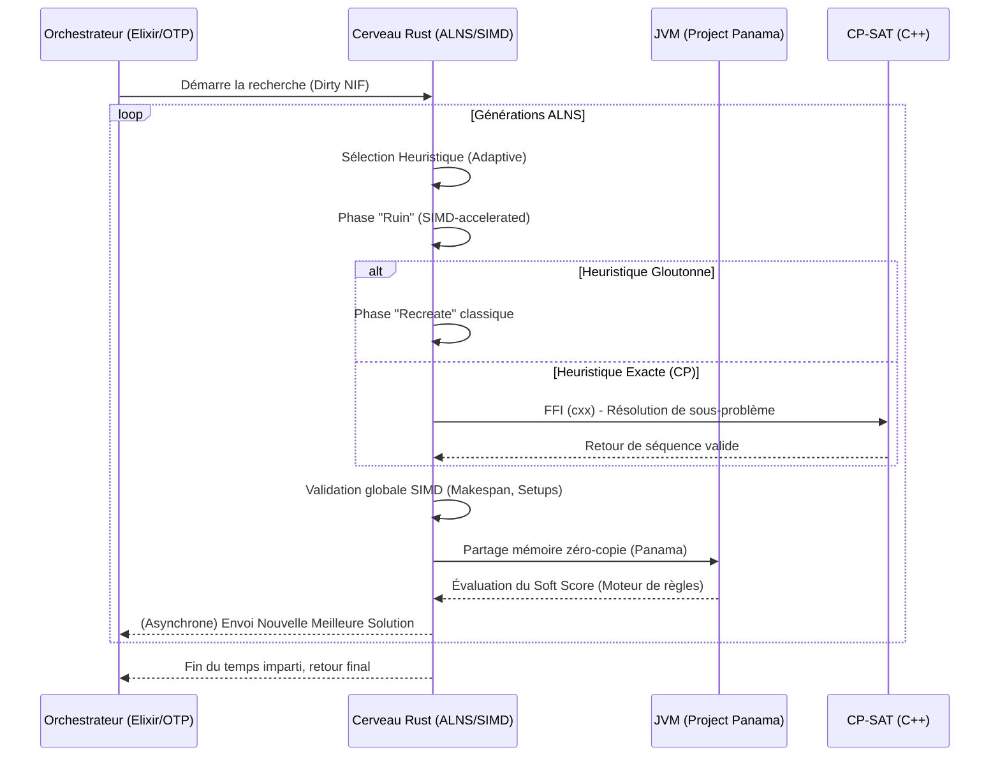

# Document de Conception Technique : Moteur de Recherche Hybride (Rust SIMD & CP-SAT)

**Auteur :** Expert Principal Rust, Calcul Haute Performance (SIMD) et CP
**Date :** 21 Mars 2026
**Projet :** HexaPlanner - Jumeau Numérique pour Job Shop Scheduling et Optimisation Ferroviaire

---

## 1. Vision Structurale et Memory Layout

Afin de garantir une absence totale de Garbage Collection pendant l'exploration de l'arbre de recherche, et pour maximiser l'utilisation du cache L1/L2 (Cache-locality), la conception de la mémoire repose sur le paradigme **Data-Oriented Design (DoD)** via l'approche **SoA (Structure of Arrays)** couplée à un allocateur par arène (Arena Allocator).

### 1.1 Conception Mémoire (Memory Layout)

L'état de la planification est encodé sous forme de vecteurs denses alloués de façon contiguë dans des arènes (via la crate `bumpalo` en Rust 2024).

```rust
// Layout Mémoire SoA pour garantir une vectorisation SIMD maximale
pub struct JobShopState {
    pub task_start_times: Vec<u32>,      // Alignement strict
    pub task_durations: Vec<u32>,        // Pour chargement dans u32x16
    pub task_machine_ids: Vec<u16>,
    pub task_dependencies: Vec<u32>,     // Bitmask ou index d'adjacence
}
```

**Cycle de Vie de la Mémoire :**
À chaque itération (génération), une arène est instanciée. Les états candidats sont générés sans aucune désallocation individuelle. En fin d'itération, l'arène est libérée en *O(1)*. Le surcoût d'allocation/désallocation est virtuellement nul.

---

## 2. Accélération SIMD (`std::simd` via AVX-512 / ARM NEON)

L'évaluation de la validité de la séquence et la propagation des dépendances temporelles (calcul du *makespan*) se feront par blocs vectoriels de 16 ou 32 tâches. Avec Rust Édition 2024, `std::simd` est pleinement stabilisé.

### Stratégie Vectorielle
Lorsqu'un mouvement est testé, le moteur ne recalcule pas séquentiellement l'arbre. Il charge les temps de début, les durées et les temps de setup (setup times) dans des registres SIMD de 512 bits (AVX-512, `u32x16`) ou 256 bits (AVX2 / ARM NEON).

```rust
use std::simd::u32x16;
use std::simd::cmp::SimdPartialOrd;

pub fn validate_moves_simd(
    starts: u32x16, 
    durations: u32x16, 
    dependant_starts: u32x16
) -> u32x16 {
    // Calcul de la fin des tâches actuelles
    let ends = starts + durations;
    
    // Un masque vectoriel SIMD permet d'évaluer 16 mouvements en un seul cycle
    // (ends <= dependant_starts)
    ends.simd_le(dependant_starts).to_int() 
}
```

---

## 3. Architecture Hybride (ALNS + CP)

Le cerveau algorithmique combine **Adaptive Large Neighborhood Search (ALNS)** pour l'exploration macroscopique et **Constraint Programming (CP-SAT)** pour la reconstruction optimale des voisinages détruits.

### 3.1 Signatures des Traits Rust pour l'ALNS

```rust
use rand_pcg::Pcg64Mcg;

pub trait RuinHeuristic {
    /// Détruit un sous-ensemble du graphe (ex: 15% des tâches critiques)
    fn ruin(&self, state: &mut JobShopState, rng: &mut Pcg64Mcg) -> RuinedState;
}

pub trait RecreateHeuristic {
    /// Reconstruit la solution partielle en utilisant une heuristique gloutonne ou CP-SAT
    fn recreate(&self, partial: RuinedState, cp_solver: &mut CpSatBridge) -> JobShopState;
}

pub trait ScoreEvaluator {
    /// Évaluation extrêmement rapide du score (pénalités souples) via SIMD
    fn evaluate(&self, state: &JobShopState) -> i64;
}
```

### 3.2 Pont FFI avec Google OR-Tools CP-SAT
La phase de `Recreate` fait ponctuellement appel au solveur CP-SAT pour générer de manière instantanée une sous-séquence topologiquement parfaite (ex: réinsérer 30 tâches sans violer les contraintes de setup).

L'interfaçage se fera via la crate **`cxx`** pour des appels C++ FFI "Safe" sans overhead. Les protobufs CP-SAT sont générés en Rust via `prost` pour configurer le modèle de sous-problème qui est envoyé au runtime C++ d'OR-Tools.

---

## 4. Interopérabilité : Le Pont Java - Rust - Elixir

### 4.1 Vers Java / GraalVM (Project Panama)
Pour échanger les données avec OptaPlanner (qui réside sur la JVM), l'utilisation historique de JNI est abandonnée au profit du **Project Panama (Foreign Function & Memory API)**.
1. Le moteur Rust alloue l'état dans un pointeur de mémoire partagée.
2. Java accède directement à ce Memory Segment (Zero-Copy).
3. Les appels de fonctions se font via des Downcall/Upcall Method Handles pour minimiser la latence de franchissement du pont.

### 4.2 Vers Elixir / BEAM (Rustler NIFs)
L'orchestrateur système, reposant sur Erlang/OTP, gère les aspects distribués et la haute disponibilité de HexaPlanner.
- L'intégration se fait via la crate **`rustler`**.
- La fonction de recherche principale (ALNS Loop) est taguée comme un **Dirty NIF (CPU Bound)** (`#[rustler::nif(schedule = "DirtyCpu")]`). Cela permet au moteur Rust de monopoliser un thread OS dédié aux calculs intenses sans jamais bloquer ou affamer les schedulers de la VM BEAM d'Elixir.
- L'échange d'informations (statistiques, meilleure solution courante) se fait via des envois de messages asynchrones (Message Passing) depuis Rust vers le PID du processus Elixir superviseur.

---

## 5. Diagramme de Flux d'Exécution (Execution Flow)



## Conclusion

Ce design tire parti de ce que 2026 a de mieux à offrir : l'écosystème Rust 2024 stabilisé, la vectorisation explicite standardisée pour des performances extrêmes, et des ponts d'interopérabilité modernes (Project Panama, Rustler, `cxx`) pour combiner harmonieusement le contrôle système (Elixir), l'évaluation métier (Java) et l'optimisation pure (Rust/C++).